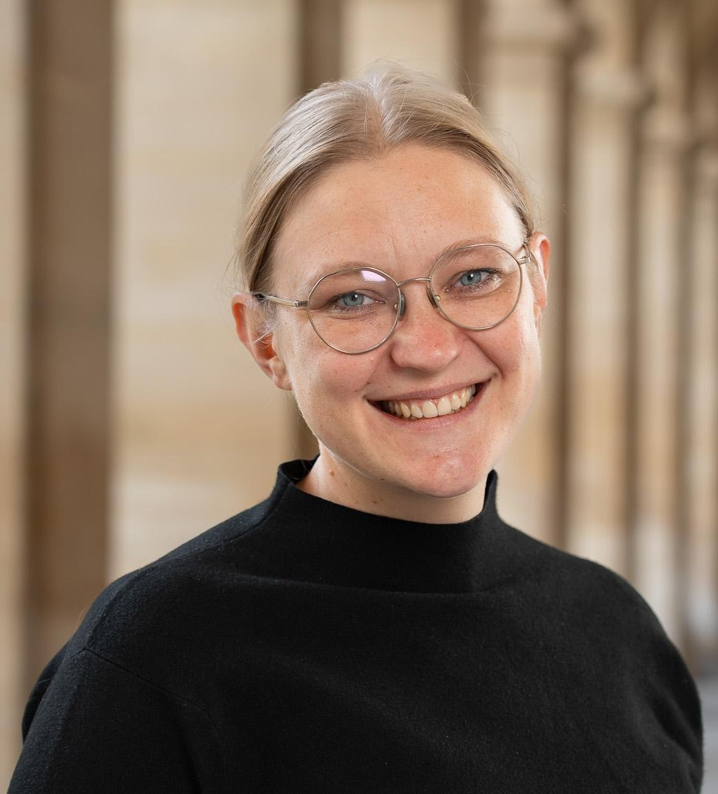

# Welcome!

 

I am an Assistant Professor at the Centre for European Studies and Comparative Politics at Sciences Po Paris. My research interests lie in policy-making in the European Union and in migration policies and politics, including links between migration and other policy fields such as trade. Methodologically, I rely on both quantitative and qualitative methods, including computational political science methods, survey experiments as well as process tracing methods in combination with interviews.

I obtained my PhD from the University of Geneva in 2023, and have held visiting positions at the European University Institute, the Max Planck Institute for the Study of Societies, and the Vrije Universiteit Brussels. Before joining Sciences Po, I was a Postdoctoral Researcher at the Chair for European and Multilevel Governance at the Department of Political Science, University of Cologne. You can find out more about my research [here](research.qmd).

Before joining academia, I worked as a Research and Policy Officer for the European Migration Network. I remain committed to policy-relevant work and to providing expertise for migration policy and advocacy, for example as a country expert for Germany for the Asylum Information Database. You can find out more about my work on migration and asylum policy in Germany [here](migration-policy.qmd).