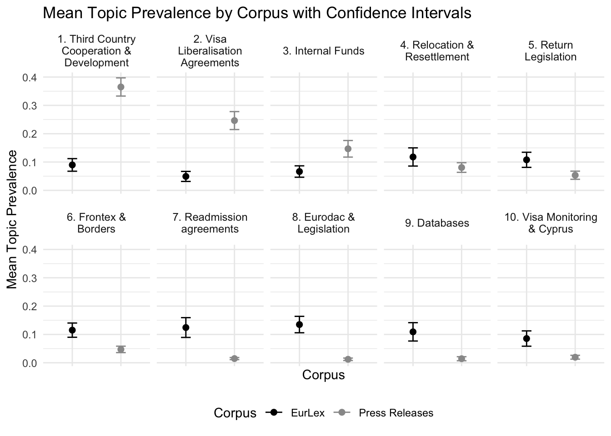
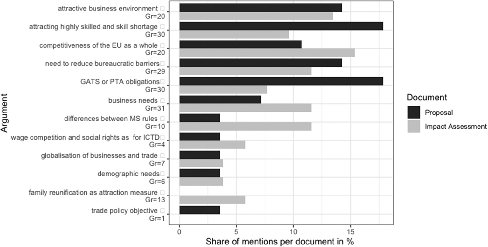
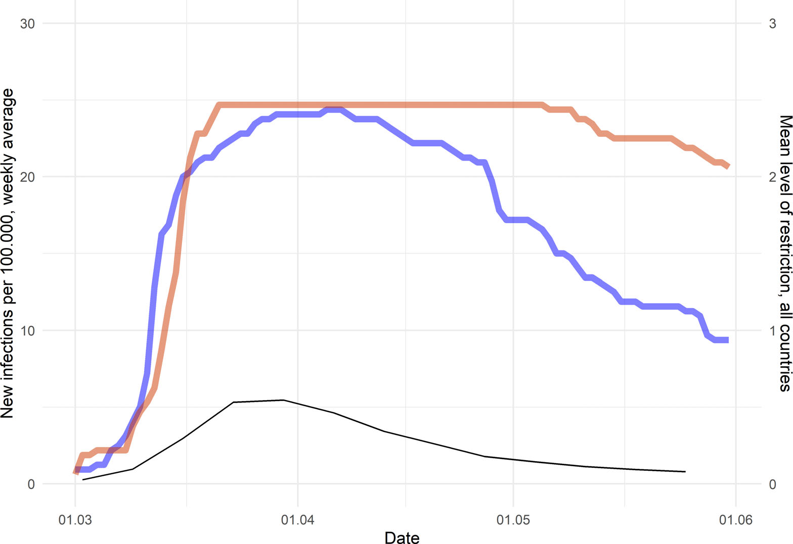
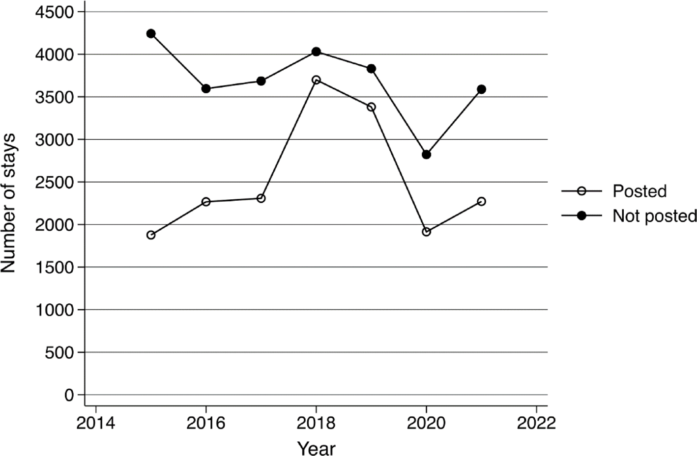
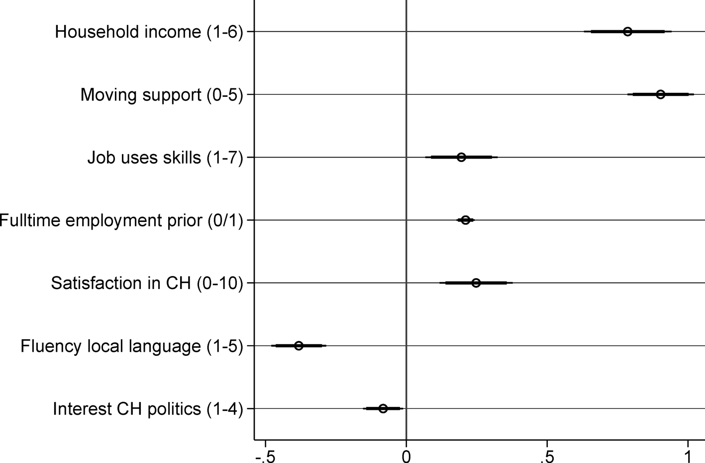
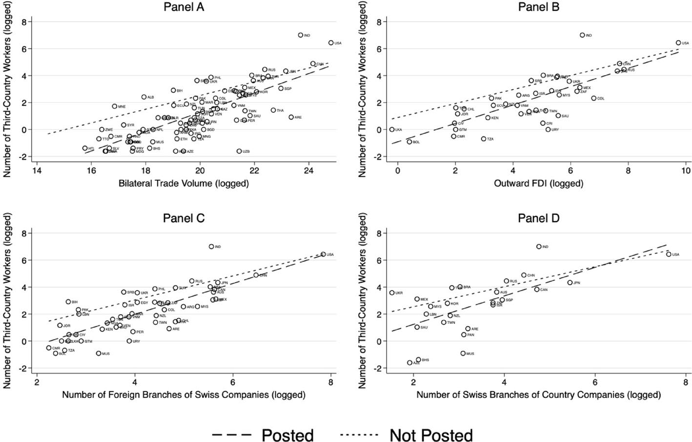
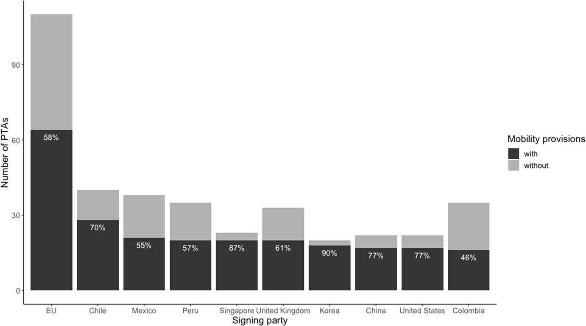
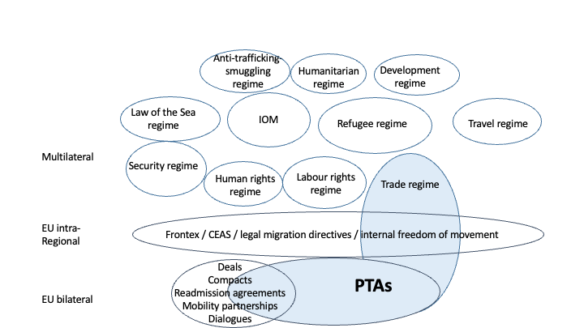

# Research

<br>

I study the politics and policies of immigration in Europe and the EU, and the links between trade and immigration policies. I am also interested in narratives around immigration and the discursive construction of "migration" and "mobility". See also my [Google Scholar profile](https://scholar.google.ch/citations?user=T5tODPIAAAAJ&hl=de&oi=ao).

<br>

## Migration Policies in the EU and Europe

<br>

::: {.publication-item}
<div class="publication-image">
  
</div>
<div class="publication-content">

Hoffmeyer-Zlotnik, Paula and Philipp Stutz (2026). ["Changing Norms in EU Return Policy? A longitudinal analysis of Commission documents on return."](https://doi.org/10.1080/1369183X.2026.2633666) *Journal of Ethnic and Migration Studies*, online first.

</div>
:::

::: {.publication-item}
<div class="publication-image">
  
</div>
<div class="publication-content">

Hoffmeyer-Zlotnik, Paula, Sandra Lavenex, and Philipp Lutz (2024). ["The Limits of EU Market Power in Migration Externalization: Explaining Migration Control Provisions in EU Preferential Trade Agreements."](https://doi.org/10.1111/jcms.13563) *JCMS: Journal of Common Market Studies* 62(5): 1351-1378.

</div>
:::

::: {.publication-item}
<div class="publication-image">
  
</div>
<div class="publication-content">


Hoffmeyer-Zlotnik, Paula (2024). ["The Quiet Politics of Migration Supranationalization – Commission Entrepreneurship and the Intra-Corporate Transferee Directive."](https://doi.org/10.1080/07036337.2023.2295374) *Journal of European Integration* 46(3): 365–86.

</div>
:::

::: {.publication-item}
<div class="publication-image">
  
</div>
<div class="publication-content">


Rausis, Frowin, and Paula Hoffmeyer-Zlotnik (2021). ["Contagious Policies? Studying National Responses to a Global Pandemic in Europe."](https://doi.org/10.1111/spsr.12450) *Swiss Political Science Review* 27(2): 283–96.

</div>
:::


**Work in progress:** When Do Crises Enable Reform? EU Energy and Migration Policy After the Invasion of Ukraine (with Jordy Weyns).

<br>

## Trade Agreements and Migration Governance

<br>

::: {.publication-item}
<div class="publication-image">
  
</div>
<div class="publication-content">

Lavenex, Sandra, Paula Hoffmeyer-Zlotnik, Mariana Alvarado, and Philipp Lutz (2025). ["Attracting Migrants through the Backdoor: Business Migration in Switzerland."](https://doi.org/10.1093/migration/mnaf028) *Migration Studies* 13(3): online first.

</div>
:::

::: {.publication-item}
<div class="publication-image">
  
</div>
<div class="publication-content">

Alvarado, Mariana, Paula Hoffmeyer-Zlotnik, Sandra Lavenex, and Philipp Lutz (2025). ["Business migration between labour and trade: evidence from Switzerland."](https://comparativemigrationstudies.springeropen.com/articles/10.1186/s40878-025-00483-7) *Comparative Migration Studies* (online first).

</div>
:::

::: {.publication-item}
<div class="publication-image">
  
</div>
<div class="publication-content">

Hoffmeyer-Zlotnik, Paula, Sandra Lavenex, and Philipp Lutz (2025). ["Migration governance through trade agreements – a two-level analysis."](https://verlag.oeaw.ac.at/produkt/drawing-boundaries-and-crossing-borders-migration-in-theorie-und-praxis/99200984.) In *Drawing Boundaries and Crossing Borders: Migration in Theorie und Praxis*, vol. 7. Jahrbuch Migrationsforschung. Verlag der ÖAW.

</div>
:::

::: {.publication-item}
<div class="publication-image">
  
</div>
<div class="publication-content">

Lavenex, Sandra, Philipp Lutz, and Paula Hoffmeyer-Zlotnik (2024). ["Migration Governance through Trade Agreements: Insights from the MITA Dataset."](https://link.springer.com/article/10.1007/s11558-023-09493-5) *The Review of International Organizations* 19: 147–173.

</div>
:::

::: {.publication-item}
<div class="publication-image">
  
</div>
<div class="publication-content">

Hoffmeyer-Zlotnik, Paula, Sandra Lavenex, and Philipp Lutz (2023). ["Expanding, Complementing, or Substituting Multilateralism? EU Preferential Trade Agreements in the Migration Regime Complex."](https://www.cogitatiopress.com/politicsandgovernance/article/view/6341) *Politics and Governance* 11(2): 49–61.

</div>
:::

**Work in progress:** Trading migration? Explaining Mobility Provisions in Preferential Trade Agreements (with Philipp Lutz and Sandra Lavenex).

<br>

## How migration and mobility relate to each other

<br>

::: {.publication-item}
<div class="publication-image">
  
</div>
<div class="publication-content">

Hoffmeyer-Zlotnik, Paula (2024). ["Perspectives of Flow and Place: Rethinking Notions of Migration and Mobility in Policy-Making."](https://doi.org/10.1080/1369183X.2023.2278400.) *Journal of Ethnic and Migration Studies* 50(6): 1299–1316.

</div>
:::

::: {.publication-item}
<div class="publication-image">
  
</div>
<div class="publication-content">

**What Is the Nexus between Migration and Mobility?**

Piccoli, Lorenzo, Matteo Gianni, Didier Ruedin, Christin Achermann, Janine Dahinden, Paula Hoffmeyer-Zlotnik, Mihaela Nedelcu, and Tania Zittoun (2024). ["What Is the Nexus between Migration and Mobility? A Framework to Understand the Interplay between Different Ideal Types of Human Movement."](https://doi.org/10.1177/00380385241228836) *Sociology* (online first).

</div>
:::

```{=html}
<script src="lightbox.js"></script>
```
